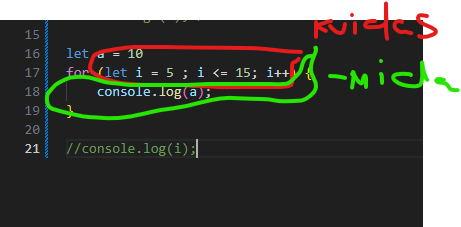

while tsukkel on stukel , mis taidab koodiblokki seni, kuni tingimus on taidetud.
- tingimus 
- koodiblock 

# Functsioon // nagu variable 
koorduvkasutratav koodiplok, mis on moeldud teatud ulesande taitmiseks, mida saab programmi teistes osades uuesti kasutada.
- console.log ()
- alert()
- prompt()
- confirm()
- Number()
- String()
  - # Koosneb:
  - marksona funktsiooni deklareerimiseks 
  - functsion nimi
  - parametsrid 
  - function sisu/keha {}
  - tagastusavaldus functsiooni kehas - `return`
- Tsükkel lõpeb siis, kui tema tingimus enam ei ole tõene (false).Ehk teisisõnu — kui kontroll, mis on sul sulgudes, muutub valeks, siis tsükkel peatub